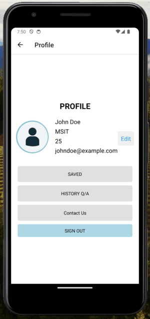

## Team Members:
1. Velakatoori Harshitha-M15890106
2. Nikhil Palli-M15802129
3. Venkat Sai Uppu-M15889949
## Problem Domain:
Every student at the university may need help related to different things in their day to-day
lives. Everyone could be familiar with the new things of work or course work and fee
payments. It is not only about general problems. Sometimes it is also about technical
problems with the sand box or canvas. The existing solutions or designed things couldn’t fit
for recent problems.
## Project Idea:
I want to develop an ```My Help``` application for MSIT students that can help students at the
university learn about different things related to the university. It has questions related to the
university course work, network problems, canvas, and catalyst. The students can express
their questions, and others can give a solution. This can help students choose a fast and
reliable solution for their problem.
## Application over-view:
- 1. My Help" is a mobile app designed to facilitate communication and collaboration among
MSIT students.
- 2. The app aims to create a supportive community where students can help each other with
technical challenges and other common questions related to university.
## Target Users:
- 1.MSIT students who need support with Course or other IT related problems.
- 2.People of MSIT willing to contribute solutions to IT students
## User Interface:
- 1.Home Feed: Home with recent questions and topics to select by users to see. [ using filter to
so related questions]
- 2.Question Posting: Post their questions or technical problem they encountered.
- 3.Solution sharing: Users can provide solutions to posted questions and Upvoting and
commenting features to enhance engagement.
4.Profile and notifications: User profiles with history of questions and answers and
Notifications about new responses to posted questions
## Expected Impact and Result:
- 1.Empower MSIT students to conquer IT difficulties together.
- 2.Encourage a feeling of community and information sharing in the MSIT program.
- 3.Increase general IT literacy and problem-solving abilities in the MSIT community.
  
**_Profile _**:




